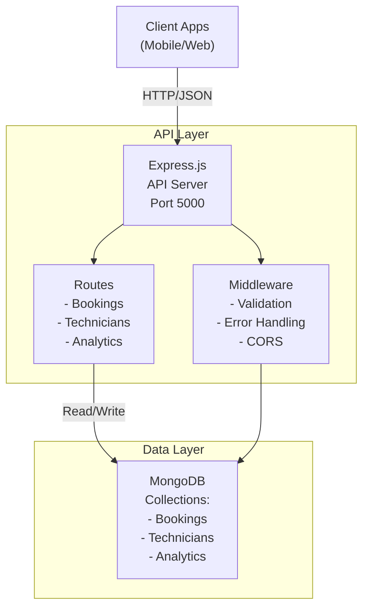

# PunctureWala Platform - Architecture

## System Architecture Overview



## 3-Tier Architecture

### Presentation Tier
- Mobile and web clients consume REST API endpoints
- Health check endpoint for monitoring

### Application Tier
- **Express.js Server**: Core API server handling HTTP requests
- **Routes**: Modular route handlers for each resource
  - `/api/bookings` - Booking management
  - `/api/technicians` - Technician management
  - `/api/analytics` - Analytics data
- **Middleware**: Validation, error handling, CORS

### Data Tier
- **MongoDB**: NoSQL database storing all application data
- **Collections**:
  - `Bookings`: Service booking requests and history
  - `Technicians`: Technician profiles and ratings
  - `Analytics`: Daily aggregated metrics

## Database Schema

### Booking Collection
```json
{
  "bookingId": "BK-1234567890",
  "customerId": ObjectId,
  "customerName": "string",
  "customerPhone": "string",
  "technicianId": ObjectId,
  "technicianName": "string",
  "location": {
    "latitude": number,
    "longitude": number,
    "address": "string"
  },
  "status": "pending | accepted | in-progress | completed | cancelled",
  "bookingTime": Date,
  "completionTime": Date,
  "serviceType": "puncture-repair | tire-replacement | wheel-alignment | emergency",
  "amount": number,
  "paymentStatus": "pending | completed | failed",
  "rating": number,
  "notes": "string"
}
```

### Technician Collection
```json
{
  "technicianId": "TECH-1001",
  "name": "string",
  "phone": "string",
  "email": "string",
  "experience": number,
  "rating": number,
  "serviceArea": ["string"],
  "status": "active | inactive | on-break",
  "totalBookings": number,
  "completedBookings": number,
  "hourlyRate": number,
  "isVerified": boolean
}
```

### Analytics Collection
```json
{
  "date": Date,
  "totalBookings": number,
  "completedBookings": number,
  "totalRevenue": number,
  "averageRating": number,
  "activeTechnicians": number,
  "serviceTypeDistribution": {
    "punctureRepair": number,
    "tireReplacement": number
  }
}
```

## API Endpoints

### Bookings
- `POST /api/bookings` - Create new booking
- `GET /api/bookings` - List bookings with filters
- `GET /api/bookings/:id` - Get booking details
- `PATCH /api/bookings/:id` - Update booking status
- `DELETE /api/bookings/:id` - Cancel booking

### Technicians
- `POST /api/technicians` - Register technician
- `GET /api/technicians` - List technicians
- `GET /api/technicians/:id` - Get technician profile
- `PUT /api/technicians/:id` - Update technician info
- `DELETE /api/technicians/:id` - Deactivate technician

### Analytics
- `GET /api/analytics` - Get 30-day summary
- `GET /api/analytics?days=N` - Custom period analytics
- `GET /api/analytics/date/:date` - Specific date analytics

### Health
- `GET /health` - API health status

## Data Flow

1. **Booking Request**: Customer initiates booking → API validates → MongoDB saves → Analytics updated
2. **Technician Assignment**: System queries available technicians → Sends to nearest → Updates status
3. **Completion**: Technician marks complete → Payment processed → Rating recorded → Analytics aggregated
4. **Reports**: Analytics endpoint aggregates daily metrics → Returns summary statistics

## Technology Stack

- **Runtime**: Node.js 16+
- **Framework**: Express.js 4.18
- **Database**: MongoDB 5.0+
- **Validation**: Joi
- **Testing**: Jest, Supertest
- **Error Handling**: Express async errors
- **API Format**: JSON REST

## Scalability Considerations

1. **Indexing**: Implemented on frequently queried fields
2. **Pagination**: Implemented for large result sets
3. **Horizontal Scaling**: Stateless design enables horizontal scaling
4. **Caching**: Redis can be added for frequently accessed data
5. **Database Sharding**: Ready for shard by technicianId or region

## Deployment

- Docker containerized with MongoDB service
- Environment variables for configuration
- Health check endpoint for load balancers
- Proper error handling and logging
